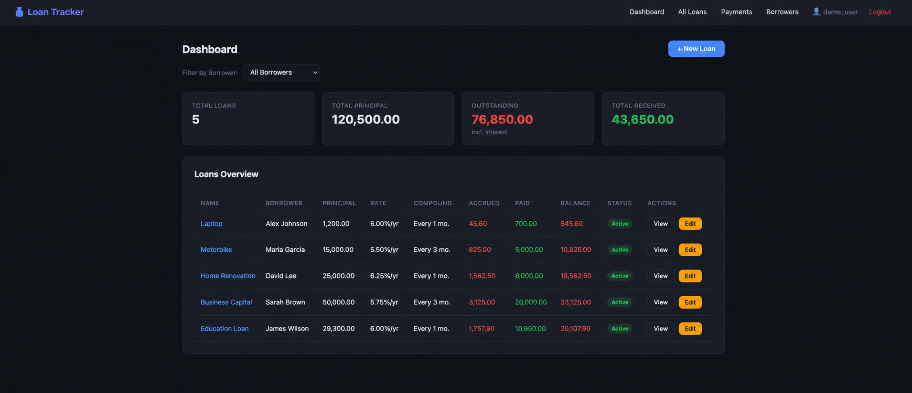

# Loan Tracker

A self-hosted personal loan tracker built with PHP 8.2 + SQLite, running in Docker.

Track loans you've given out — principal, interest, compound periods, payments, and balances.

Developed by [IT4Co](https://www.it4co.com).

## Screenshot



## Features

- Multiple borrowers per loan
- Compound interest calculation
- Payment history and running balance
- Per-borrower dashboard filter
- Borrower management screen
- Audit history per loan
- Dark UI

## Quick Start

```bash
git clone https://github.com/nikolas22t/loantracker.git
cd loantracker
docker compose up -d
```

Open [http://localhost:8110](http://localhost:8110)

**Default credentials** (change immediately):
| Username | Password  |
|----------|-----------|
| admin    | admin123  |
| demo     | demo123   |

To change a password, update the hash in `public/config.php`:
```bash
php -r 'echo password_hash("yournewpassword", PASSWORD_DEFAULT);'
```

## Data

SQLite database is stored in a Docker volume (`loan_data`). To back up:
```bash
docker cp loan_tracker:/var/www/data/loans.db ./loans.db.bak
```

## Port

Default port: **8110** — change in `docker-compose.yml` and `Dockerfile` if needed.

## License

MIT
